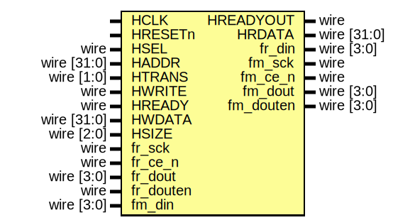

# EF_QSPI_FLASH_WRITER

A Quad SPI Flash Writer used to program flash. It can be used along with flash controller to program the flash then read from it.
## The wrapped IP


 The IP comes with an AHBL Wrapper

### Wrapped IP System Integration

```verilog
EF_QSPI_FLASH_WRITER INST (
        `TB_AHBL_SLAVE_CONN,
        .fr_sck(fr_sck),
        .fr_ce_n(fr_ce_n),
        .fr_din(fr_din),
        .fr_dout(fr_dout),
        .fr_douten(fr_douten),
        .fm_sck(fm_sck),
        .fm_ce_n(fm_ce_n),
        .fm_din(fm_din),
        .fm_dout(fm_dout),
        .fm_douten(fm_douten)
);
```
> **_NOTE:_** `TB_AHBL_SLAVE_CONN is a convenient macro provided by [BusWrap](https://github.com/efabless/BusWrap/tree/main).

## Implementation example  

The following table is the result for implementing the EF_QSPI_FLASH_WRITER IP with different wrappers using Sky130 PDK and [OpenLane2](https://github.com/efabless/openlane2) flow.
|Module | Number of cells | Max. freq |
|---|---|---|
|EF_QSPI_FLASH_WRITER|TBD|TBD|
## The Programmer's Interface


### Registers

|Name|Offset|Reset Value|Access Mode|Description|
|---|---|---|---|---|
|WE|0000|0x00000000|w|Write Enable; enables flash writer to write to flash|
|SS|0004|0x00000000|w|Slave Select; flash SS signal value|
|SCK|0008|0x00000000|w|Slave Clock; flash SCK signal value|
|OE|000c|0x00000000|w|Output enable for the four flash IOs|
|DATAO|0010|0x00000000|w|Output Data from the flash writer or controller going to flash|
|DATAI|0014|0x00000000|r|Input Data coming from flash flash|

### WE Register [Offset: 0x0, mode: w]

Write Enable; enables flash writer to write to flash


### SS Register [Offset: 0x4, mode: w]

Slave Select; flash SS signal value


### SCK Register [Offset: 0x8, mode: w]

Slave Clock; flash SCK signal value


### OE Register [Offset: 0xc, mode: w]

Output enable for the four flash IOs


### DATAO Register [Offset: 0x10, mode: w]

Output Data from the flash writer or controller going to flash


### DATAI Register [Offset: 0x14, mode: r]

Input Data coming from flash flash


### The Interface 


#### Ports 

|Port|Direction|Width|Description|
|---|---|---|---|
|fr_sck|input|1|spi clock coming from flash reader|
|fr_ce_n|input|1|spi slave select coming from flash reader|
|fr_din|output|4|spi master data in going to the flash reader|
|fr_dout|input|4|spi master data out coming from flash reader|
|fr_douten|input|4|spi master data out enable coming from flash reader|
|fm_sck|output|1|spi clock going to flash (slave)|
|fm_ce_n|output|1|spi slave select going to flash (slave)|
|fm_din|input|4|spi master data in coming from flash (slave)|
|fm_dout|output|4|spi master data out going to flash (slave)|
|fm_douten|output|4|spi master data out enable going to flash (slave)|
## F/W Usage Guidelines:
TBD
## Installation:
You can either clone repo or use [IPM](https://github.com/efabless/IPM) which is an open-source IPs Package Manager
* To clone repo:
```git clone https://github.com/efabless/EF_QSPI_FLASH_WRITER```
* To download via IPM , follow installation guides [here](https://github.com/efabless/IPM/blob/main/README.md) then run 
```ipm install EF_QSPI_FLASH_WRITER```
### Run cocotb UVM Testbench:
TBD