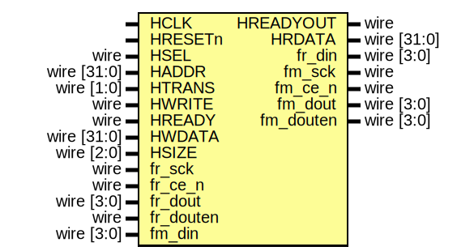

# EF_QSPI_FLASH_WRITER

A Quad SPI Flash Writer used to program flash. It can be used along with flash controller to program the flash then read from it.
## The wrapped IP


 The IP comes with an AHBL Wrapper

#### Wrapped IP System Integration

```verilog
EF_QSPI_FLASH_WRITER_APB INST (
	`TB_AHBL_SLAVE_CONN,
	.fr_sck(fr_sck)
	.fr_ce_n(fr_ce_n)
	.fr_din(fr_din)
	.fr_dout(fr_dout)
	.fr_douten(fr_douten)
	.fm_sck(fm_sck)
	.fm_ce_n(fm_ce_n)
	.fm_din(fm_din)
	.fm_dout(fm_dout)
	.fm_douten(fm_douten)
);
```
> **_NOTE:_** `TB_APB_SLAVE_CONN is a convenient macro provided by [BusWrap](https://github.com/efabless/BusWrap/tree/main).
#### Wrappers with DFT support
Wrappers in the directory ``/hdl/rtl/bus_wrappers/DFT`` have an extra input port ``sc_testmode`` to enable the clock gate whenever the scan chain testmode is enabled.

## Implementation example  

The following table is the result for implementing the EF_QSPI_FLASH_WRITER IP with different wrappers using Sky130 PDK and [OpenLane2](https://github.com/efabless/openlane2) flow.
|Module | Number of cells | Max. freq |
|---|---|---|
|EF_QSPI_FLASH_WRITER|N/A| N/A |
|EF_QSPI_FLASH_WRITER_AHBL|TBD|TBD|
## The Programmer's Interface


### Registers

|Name|Offset|Reset Value|Access Mode|Description|
|---|---|---|---|---|
|WE|0000|0x00000000|w|Write Enable; enables flash writer to write to flash|
|SS|0004|0x00000000|w|Slave Select; flash SS signal value|
|SCK|0008|0x00000000|w|Slave Clock; flash SCK signal value|
|OE|000c|0x00000000|w|Output enable for the four flash IOs|
|DATAO|0010|0x00000000|w|Output Data from the flash writer or controller going to flash|
|DATAI|0014|0x00000000|r|Input Data coming from flash flash|

### WE Register [Offset: 0x0, mode: w]

Write Enable; enables flash writer to write to flash


### SS Register [Offset: 0x4, mode: w]

Slave Select; flash SS signal value


### SCK Register [Offset: 0x8, mode: w]

Slave Clock; flash SCK signal value


### OE Register [Offset: 0xc, mode: w]

Output enable for the four flash IOs


### DATAO Register [Offset: 0x10, mode: w]

Output Data from the flash writer or controller going to flash


### DATAI Register [Offset: 0x14, mode: r]

Input Data coming from flash flash


### Clock Gating
The IP has clock gating feature, enabling the selective activation and deactivation of the clock as required through the ``GCLK`` register. This functionality is implemented through the ``ef_util_gating_cell``, which is part of the the common modules library, [ef_util_lib.v](https://github.com/efabless/EF_IP_UTIL/blob/main/hdl/ef_util_lib.v). By default, the cell operates with a behavioral implementation, but when the ``CLKG_SKY130_HD`` macro is enabled, the ``sky130_fd_sc_hd__dlclkp_4`` clock gating cell is used.

**Note:** If you choose the [OpenLane2](https://github.com/efabless/openlane2) flow for implementation and would like to add the clock gating feature, you need to add ``CLKG_SKY130_HD`` macro to the ``VERILOG_DEFINES`` configuration variable. Update the YAML configuration file as follows: 
```
VERILOG_DEFINES:
- CLKG_SKY130_HD
```

### The Interface 



#### Ports 

|Port|Direction|Width|Description|
|---|---|---|---|
|fr_sck|input|1|spi clock coming from flash reader|
|fr_ce_n|input|1|spi slave select coming from flash reader|
|fr_din|output|4|spi master data in going to the flash reader|
|fr_dout|input|4|spi master data out coming from flash reader|
|fr_douten|input|4|spi master data out enable coming from flash reader|
|fm_sck|output|1|spi clock going to flash (slave)|
|fm_ce_n|output|1|spi slave select going to flash (slave)|
|fm_din|input|4|spi master data in coming from flash (slave)|
|fm_dout|output|4|spi master data out going to flash (slave)|
|fm_douten|output|4|spi master data out enable going to flash (slave)|
## Firmware Drivers:
Firmware drivers for EF_QSPI_FLASH_WRITER can be found in the [fw](https://github.com/efabless/EF_QSPI_FLASH_WRITER/tree/main/fw) directory. EF_QSPI_FLASH_WRITER driver documentation  is available [here](https://github.com/efabless/EF_QSPI_FLASH_WRITER/blob/main/fw/README.md).
You can also find an example C application using the EF_QSPI_FLASH_WRITER drivers [here]().
## Installation:
You can either clone repo or use [IPM](https://github.com/efabless/IPM) which is an open-source IPs Package Manager
* To clone repo:
```git clone https://github.com/efabless/EF_QSPI_FLASH_WRITER```
> **Note:** If you choose this method, you need to clone [EF_IP_UTIL](https://github.com/efabless/EF_IP_UTIL.git) repository, as it includes required modules from the common modules library, [ef_util_lib.v](https://github.com/efabless/EF_IP_UTIL/blob/main/hdl/ef_util_lib.v)
* To download via IPM , follow installation guides [here](https://github.com/efabless/IPM/blob/main/README.md) then run 
```ipm install EF_QSPI_FLASH_WRITER```
> **Note:** This method is recommended as it automatically installs [EF_IP_UTIL](https://github.com/efabless/EF_IP_UTIL.git) as a dependency.
